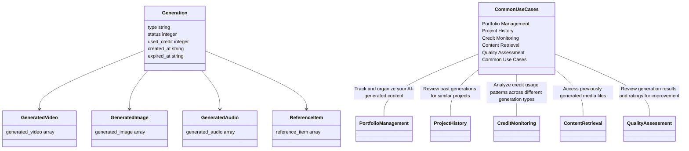

## Page 1

On this page

---

Resources

# Generation History APIs

Retrieve and manage your generation history with detailed information about past AI generations.

---

The GeminiGen.AI History APIs allow you to retrieve and manage your generation history. You can fetch all your past generations with pagination and filtering, or get detailed information about a specific generation including all associated media files.

## Get All Generation History

GET https://api.geminigen.ai/uapi/v1/histories

This endpoint allows you to retrieve a paginated list of all your generation history. You can filter results and control pagination to efficiently browse through your past generations.

### Example Request

<table>
  <thead>
    <tr>
      <th>terminal</th>
      <th>py</th>
      <th>js</th>
    </tr>
  </thead>
  <tbody>
    <tr>
      <td colspan="3">curl -X GET "https://api.geminigen.ai/uapi/v1/histories?filter_by=all&items_per_page=10&page=1" \</td>
    </tr>
    <tr>
      <td colspan="3">-H "x-api-key: <your api key>"</td>
    </tr>
  </tbody>
</table>

### Query Parameters

**filter_by** string

Filter the results by generation type or status. Default value is `all`.

**items_per_page** integer

Number of items to return per page. Default value is `10`.

**page** integer

Page number for pagination. Default value is `1`.

### Example Response

```json
{
  "success": true,
  "total": 25,
  "result": [
    {
      "id": 1234,
      "uuid": "hist_abc123def456",
      "user_id": 789,
      "model_name": "imagen-4",
      "input_text": "A beautiful landscape with mountains",
      "negative_prompt": "",
      "generate_result": "https://cdn.geminigen.ai/images/hist_abc123def456.jpg",
      "input_file_path": "",
      "type": "image_generation",
      "used_credit": 10,
      "status": 2,
      "status_desc": "completed",
      "status_percentage": 100,
      "error_code": "",
      "error_message": "",
      "rating": "",
      "rating_content": "",
      "custom_prompt": "",
      "created_at": "2025-09-27T13:30:05.089Z",
      "updated_at": "2025-09-27T13:30:05.089Z",
      "file_size": 2048576,
      "expired_at": "2025-10-27T13:30:05.089Z",
      "inference_type": "text_to_image",
      "name": "Beautiful Landscape",
      "media_files": [
        {
          "type": "image",
          "url": "https://cdn.geminigen.ai/images/hist_abc123def456.jpg",
          "size": 2048576,
          "created_at": "2025-09-27T13:30:05.089Z",
          "updated_at": "2025-09-27T13:30:05.089Z"
        }
      ]
    }
  ]
}

---


## Page 2

json
{
  "created_by": "user_789",
  "thumbnail_url": "https://cdn.geminigen.ai/thumbnails/hist_abc123def456_thumb.jpg"
}
]
}
```

# Get Specific Generation History

GET https://api.geminigen.ai/uapi/v1/history/{conversion_uuid}

This endpoint allows you to retrieve detailed information about a specific generation, including all associated media files (images, videos, audio) and reference items.

## Example Request

<table>
  <thead>
    <tr>
      <th>terminal</th>
      <th>py</th>
      <th>js</th>
    </tr>
  </thead>
  <tbody>
    <tr>
      <td colspan="3">curl -X GET "https://api.geminigen.ai/uapi/v1/history/hist_abc123def456" \</td>
    </tr>
    <tr>
      <td colspan="3">-H "x-api-key: <your api key>"</td>
    </tr>
  </tbody>
</table>

## Path Parameters

**conversion_uuid** string required

The unique identifier (UUID) of the generation history item you want to retrieve.

## Example Response

<table>
  <thead>
    <tr>
      <th>Response</th>
    </tr>
  </thead>
  <tbody>
    <tr>
      <td>
        {
          "id": 1234,
          "uuid": "hist_abc123def456",
          "user_id": 789,
          "model_name": "imagen-4",
          "input_text": "A beautiful landscape with mountains",
          "negative_prompt": "",
          "generate_result": "https://cdn.geminigen.ai/images/hist_abc123def456.jpg",
          "input_file_path": "",
          "type": "image_generation",
          "used_credit": 10,
          "status": 2,
          "status_desc": "completed",
          "status_percentage": 100,
          "error_code": "",
          "error_message": "",
          "rating": "",
          "rating_content": "",
          "custom_prompt": "",
          "created_at": "2025-09-27T13:31:56.472Z",
          "updated_at": "2025-09-27T13:31:56.472Z",
          "file_size": 2048576,
          "expired_at": "2025-10-27T13:31:56.472Z",
          "inference_type": "text_to_image",
          "name": "Beautiful Landscape",
          "created_by": "user_789",
          "thumbnail_url": "https://cdn.geminigen.ai/thumbnails/hist_abc123def456_thumb.jpg",
          "generated_video": [
            {
              "id": 5678,
              "uuid": "vid_def789ghi012",
              "history_id": 1234,
              "video_uri": "videos/vid_def789ghi012.mp4",
              "duration": 8,
              "aspect_ratio": "16:9",
              "resolution": "720p",
              "person_generation": "enabled",
              "last_frame": "https://cdn.geminigen.ai/frames/vid_def789ghi012_last.jpg",
              "status": 2,
              "error_message": "",
              "video_url": "https://cdn.geminigen.ai/videos/vid_def789ghi012.mp4"
            }
          ],
          "generated_image": [
            {
              "id": 9012,
              "uuid": "img_ghi345jkl678",
              "history_id": 1234,
              "image_url": "https://cdn.geminigen.ai/images/hist_abc123def456.jpg"
            }
          ]
        }
      </td>
    </tr>
  </tbody>
</table>

---


## Page 3

json
{
  "model": "imagen-4",
  "image_uri": "images/img_ghi345jkl678.jpg",
  "response_text": "Generated successfully",
  "status": 2,
  "error_message": "",
  "style": "Photorealistic",
  "aspect_ratio": "16:9",
  "person_generation": "enabled",
  "safety_filter_level": "medium",
  "image_url": "https://cdn.geminigen.ai/images/img_ghi345jkl678.jpg",
  "file_download_url": "https://cdn.geminigen.ai/downloads/img_ghi345jkl678.jpg",
  "thumbnails": [
    {
      "id": 3456,
      "uuid": "thumb_jkl901mno234",
      "size": "small",
      "uri": "thumbnails/thumb_jkl901mno234_small.jpg",
      "url": "https://cdn.geminigen.ai/thumbnails/thumb_jkl901mno234_small.jpg"
    }
  ],
  "base64_data": ""
},
"generated_audio": [
  {
    "history_id": 1234,
    "id": 7890,
    "uuid": "aud_mno567pqr890",
    "voices": ["Gacrux"],
    "speed": 1.0,
    "model": "tts-flash",
    "model_name": "TTS Flash",
    "status": 2,
    "custom_prompt": "",
    "audio_uri": "audio/aud_mno567pqr890.mp3",
    "emotion": "neutral",
    "output_format": "mp3",
    "vibe_id": 1,
    "accent": "american",
    "output_channel": "mono",
    "audio_url": "https://cdn.geminigen.ai/audio/aud_mno567pqr890.mp3",
    "file_download_url": "https://cdn.geminigen.ai/downloads/aud_mno567pqr890.mp3"
  }
],
"reference_item": [
  {
    "id": 4567,
    "history_id": 1234,
    "uuid": "ref_pqr123stu456",
    "media_type": "image",
    "uri": "references/ref_pqr123stu456.jpg",
    "thumbnail_uri": "thumbnails/ref_pqr123stu456_thumb.jpg",
    "thumbnail_url": "https://cdn.geminigen.ai/thumbnails/ref_pqr123stu456_thumb.jpg",
    "mask_uri": "",
    "mask_url": ""
  }
]
}
```

## Response Fields

### Main History Object

**id** integer

Unique identifier for the generation history item.

**uuid** string

Universal unique identifier for the generation.

**user_id** integer

ID of the user who created this generation.

**model_name** string

Name of the AI model used for generation.

**input_text** string

The original input text or prompt used for generation.

---


## Page 4

mermaid
classDiagram
    class Generation {
        type string
        status integer
        used_credit integer
        created_at string
        expired_at string
    }
```



```mermaid
classDiagram
  class ImageGeneration {
    title Image Generation
    description Generate stunning, high-quality images from text prompts using advanced AI models.
  }